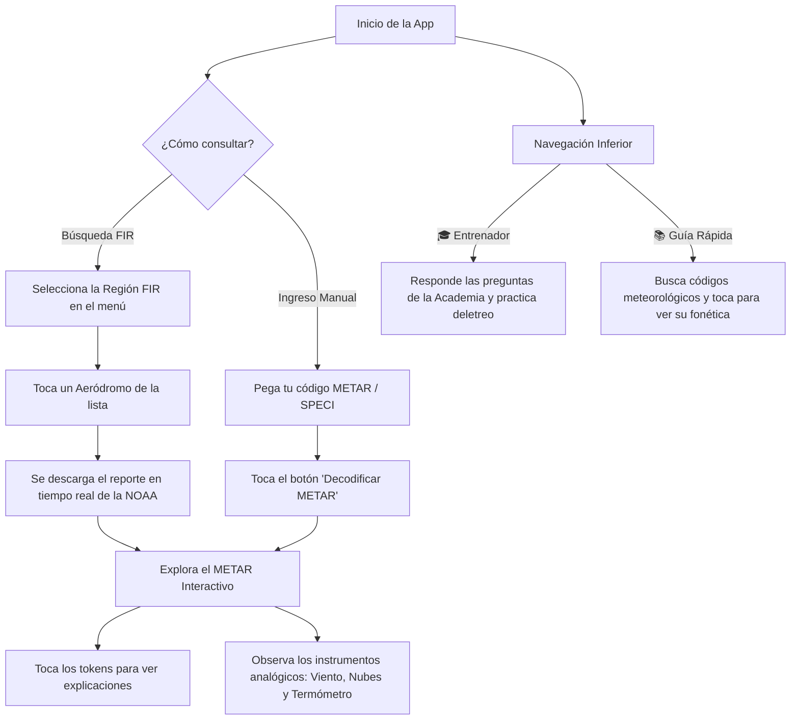

# 📡 METAR Decodificador & Entrenador 🪂
### ✈️ Brigada 2026 — Aeroclub Punta Alta

Una aplicación web interactiva, moderna y móvil-first, diseñada especialmente para alumnos y pilotos de planeador del **Aeroclub Punta Alta**. Permite consultar reportes meteorológicos reales de aeródromos argentinos y decodificarlos interactivamente con explicaciones detalladas e instrumentación gráfica en tiempo real, además de contar con una academia de entrenamiento integrada para dominar la lectura de códigos meteorológicos aeronáuticos.


---

## 🌟 Características Principales

### 1. 📡 Consulta y Decodificación en Tiempo Real
* **Búsqueda por Región FIR**: Filtra aeródromos de Argentina clasificados por sus respectivas Regiones de Información de Vuelo (**FIR Ezeiza, Córdoba, Mendoza, Resistencia, Comodoro Rivadavia** y **Antártida**).
* **Conexión en Vivo**: Obtiene los reportes meteorológicos en tiempo real directamente de la **NOAA (Aviation Weather API)** mediante un robusto sistema de reintentos con proxies CORS redundantes (`CodeTabs` y `AllOrigins`) para garantizar máxima estabilidad y funcionamiento continuo sin bloqueos.
* **Ingreso Manual**: Permite pegar cualquier reporte METAR/SPECI del mundo para decodificarlo de manera instantánea.
* **Indicación de Categoría de Vuelo**: Clasifica automáticamente las condiciones en **VFR, MVFR, IFR o LIFR** mediante un distintivo visual de colores según las regulaciones aeronáuticas (visibilidad y techo de nubes).

### 2. 🧩 Código METAR Interactivo (Tokenizador)
* Al decodificar un reporte, el código METAR se divide en bloques o tokens interactivos.
* **Interacción Bidireccional**: Al tocar o hacer clic sobre cualquier término del reporte, se resalta de forma sincronizada su tarjeta explicativa correspondiente con la traducción y explicación técnica adaptada a la aviación.

### 3. 📊 Interpretación Gráfica (Instrumental en Canvas)
Para facilitar la visualización rápida de la meteorología, la aplicación renderiza dinámicamente tres instrumentos analógicos dibujados en elementos `<canvas>`:
* **Rosa de los Vientos & Manga**: Muestra de dónde viene el viento con una flecha azul y representa físicamente la manga de viento (calcetín) inflada en el mástil y orientada según la intensidad (nudos/KT) y ráfagas (gusts) reportadas.
* **Cielo & Capas de Nubes**: Grafica la cobertura nubosa real (FEW, SCT, BKN, OVC) posicionándolas en una escala vertical de altitud en pies. Cuenta con **gráficos especiales para nubes de peligro extremo como Cumulonimbus (CB)** (con forma de yunque y relámpagos) y **Towering Cumulus (TCU)**.
* **Termómetro & Gradiente Térmico**: Muestra en paralelo la Temperatura y el Punto de Rocío. Incluye el cálculo de Humedad Relativa y emite una **Alerta de Niebla (Regla del Piloto)** si la diferencia (spread) es de 2°C o menos, advirtiendo de la formación inminente de niebla de radiación.

### 4. 🎓 Academia METAR (Entrenador / Mini-juego)
* Pon a prueba tus conocimientos antes de volar. Presenta escenarios basados en reportes reales con preguntas de opción múltiple y preguntas táctiles de entrada escrita.
* **Deletreo Fonético ICAO**: Incluye desafíos en los que debes deletrear códigos de estaciones aeronáuticas o fenómenos meteorológicos utilizando el alfabeto fonético aeronáutico internacional (ej. "SABE" $\rightarrow$ `Sierra-Alfa-Bravo-Eco`).
* **Explicaciones Académicas**: Al responder, la aplicación te proporciona una explicación conceptual detallada del porqué de la respuesta para afianzar el aprendizaje.

### 5. 📚 Guía del Piloto (Cheat Sheet Interactiva)
* Una tabla de referencia rápida y searchable (con buscador integrado en tiempo real) que reúne todos los códigos de fenómenos significativos de precipitación (RA, DZ, SN, GR, etc.), descriptores (TS, SH, FZ, etc.), nubosidad, y el alfabeto de deletreo fonético.
* **Pronunciación Táctil**: Toca cualquier código de la guía rápida para revelar instantáneamente cómo se lee fonéticamente en las radiocomunicaciones de aviación.

---

## 🛠️ Tecnologías Utilizadas

* **Estructura**: HTML5 Semántico y adaptado con Viewport escalado móvil para una experiencia táctil fluida.
* **Estilos (CSS3)**: Diseño moderno, limpio y premium basado en CSS Vanilla con variables de diseño, tarjetas de vidrio templado (Glassmorphism), fuentes tipográficas modernas (`Outfit` e `Inter` de Google Fonts) y transiciones fluidas.
* **Lógica (JS Vanilla)**: Programación orientada a objetos libre de frameworks o librerías pesadas externas, garantizando que la aplicación cargue de manera instantánea incluso con baja señal en el aeródromo.
* **Gráficos**: Motores de dibujo bidimensional personalizados mediante la API `<canvas>` de HTML5.

---

## 📖 Instructivo de Uso Rápido

> [!TIP]
> Puedes abrir la aplicación directamente en cualquier dispositivo móvil o computadora de escritorio. El diseño es 100% responsivo y se adapta perfectamente a pantallas táctiles.



### Consultando un Reporte
1. Entra a la pestaña **Consulta** (📡) en la barra de navegación inferior.
2. Si prefieres ver datos reales de Argentina, selecciona una región FIR en el desplegable (ej. **FIR EZEIZA**). Se desplegarán los aeródromos correspondientes. Al tocar uno (ej. **SABE - Aeroparque** o **SAZB - Bahía Blanca**), se buscará automáticamente el último reporte meteorológico en vivo.
3. Si prefieres ingresar un código METAR propio, cambia a **Ingreso Manual** en el selector superior, pega el texto y pulsa **🔍 Decodificar METAR**.
4. ¡Listo! Explora la sección de resultados deslizando hacia abajo. 

### Interactuando con los Gráficos
* **Manga de viento**: Si el reporte indica vientos fuertes (por ejemplo, `27018G30KT`), notarás que la manga central se orienta hacia la dirección a la que sopla y se despliega de manera totalmente recta, mientras que con vientos leves se muestra caída.
* **Nubes CB / TCU**: Si ves nubes cumulonimbus descritas como `BKN030CB`, el gráfico del cielo dibujará la silueta de tormenta característica para que aprendas a asociar el código con el peligro real de la atmósfera.
* **Termómetro interactivo**: Evalúa el riesgo de niebla. Recuerda: si la temperatura y el rocío se acercan, prepárate para visibilidad reducida en el circuito de tránsito del aeródromo.

---

## 💻 Ejecución Local

No requiere de ningún proceso complejo de compilación o instalación:
1. Clona este repositorio o descarga los archivos:
   ```bash
   git clone https://github.com/tu-usuario/entrenadormetar.git
   ```
2. Navega a la carpeta del proyecto y abre el archivo `index.html` en tu navegador web favorito:
   ```bash
   # En Windows
   start index.html
   ```
3. O bien, puedes correrlo utilizando cualquier servidor de desarrollo local como la extensión **Live Server** en VS Code o ejecutando:
   ```bash
   npx serve ./
   ```

---

## 🛩️ Dedicación
Este proyecto está dedicado a la **Brigada de Alumnos del año 2026** y a toda la comunidad de pilotos del **Aeroclub Punta Alta** (ubicado en la Provincia de Buenos Aires, Argentina), promoviendo la seguridad aérea en el vuelo sin motor mediante una sólida capacitación teórica y práctica.

*¡Buenos vuelos!* 🌤️🦅
